# M365 Copilot Studio Agent Framework
## Monitoring · Scoring · Evaluation · Testing · LangGraph Orchestration
### Session Analysis & Implementation Methodology
**Sessions:** February 24, 2026 (Framework Design) · February 26, 2026 (LangGraph Augmentation)  
**Scope:** End-to-end design, implementation specification, and LangGraph orchestration layer

---

## Table of Contents

1. [Executive Summary](#1-executive-summary)
2. [What We Built — Framework Overview](#2-what-we-built--framework-overview)
3. [Two-Layer Measurement Model](#3-two-layer-measurement-model)
4. [Attachment Processing Architecture](#4-attachment-processing-architecture)
5. [Agent Flow — Gate Architecture](#5-agent-flow--gate-architecture)
6. [Scoring and Evaluation Framework](#6-scoring-and-evaluation-framework)
7. [Safety Gate](#7-safety-gate)
8. [Dataverse Schema Design](#8-dataverse-schema-design)
9. [Smoke Test Agent Architecture](#9-smoke-test-agent-architecture)
10. [Multi-Agent Testing Pipeline](#10-multi-agent-testing-pipeline)
11. [Golden Dataset Design](#11-golden-dataset-design)
12. [Power BI Dashboard Architecture](#12-power-bi-dashboard-architecture)
13. [CI/CD Quality Gates](#13-cicd-quality-gates)
14. [Phased Rollout Plan](#14-phased-rollout-plan)
15. [Platform Observability Stack](#15-platform-observability-stack)
16. [Key Decisions Log](#16-key-decisions-log)
17. [Guide Deliverables Reference](#17-guide-deliverables-reference)
18. [LangGraph Orchestration — Strategy and Rationale](#18-langgraph-orchestration--strategy-and-rationale)
19. [LangGraph Graph Architecture](#19-langgraph-graph-architecture)
20. [LangGraph Implementation — pipelines/ Structure](#20-langgraph-implementation--pipelines-structure)
21. [LangGraph Node Design Reference](#21-langgraph-node-design-reference)
22. [LangGraph Routing Logic](#22-langgraph-routing-logic)
23. [LangGraph Phased Roadmap](#23-langgraph-phased-roadmap)

---

## 1. Executive Summary

This document captures the complete analysis and implementation methodology developed across two design sessions. The first session (February 24, 2026) produced a full, production-ready Power Platform framework for monitoring, scoring, evaluating, and testing Microsoft 365 Copilot Studio agents — with specific focus on agents that process **file attachments** (CSV, XLSX, XML, PDF). The second session (February 26, 2026) augmented that framework with a **LangGraph orchestration layer**: a Python-based stateful graph that wraps the Power Automate infrastructure and adds LLM-powered evaluation, root cause analysis, adaptive retry, human-in-the-loop approval gates, and dynamic test case generation.

The framework spans seven implementation domains:

| Guide | Domain | Core Purpose | Technology |
|-------|---------|--------------|------------|
| 01 | Dataverse Schema | The evaluation data warehouse | Dataverse OData v4 |
| 02 | Power Automate & Agent Flow | The processing and telemetry layer | Power Automate (dual-flow) |
| 03 | Scoring & Evaluation | The quality measurement model | Formula + LLM scoring |
| 04 | Power BI Dashboard | The single pane of glass | Power BI + DAX |
| 05 | Smoke Test Agent | Platform health validation | Copilot Studio + Cloud Flow |
| 06 | Multi-Agent Testing Pipeline | Deployment gate & test orchestration | PA / Azure DevOps |
| 07 *(planned)* | LangGraph Orchestration Harness | LLM-augmented stateful test orchestration | LangGraph + Python |

> **Core Principles:**
> - All evaluation data lives in Dataverse. All telemetry lives in App Insights. All governance evidence lives in Purview. Power BI joins them into a single operational view.
> - The LangGraph harness **wraps** the Power Automate dual-flow architecture — it calls `CloudFlow-FileUpload-Core` via HTTP and writes results back to the same Dataverse tables. Nothing in the PA layer changes.

---

## 2. What We Built — Framework Overview

The framework is organized as three concentric rings: **Monitor** what happened, **Score** how well it was done, and **Evaluate** whether quality is improving over time.

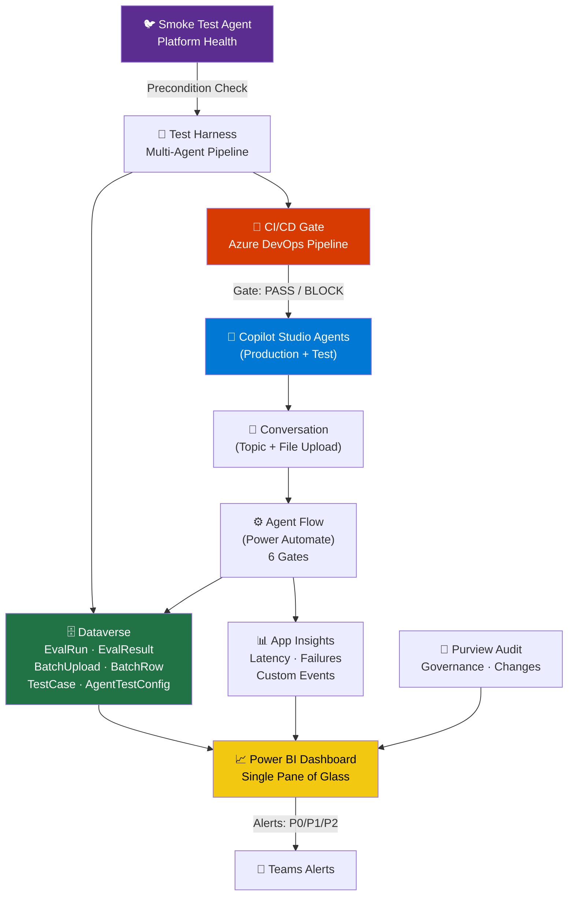

### The Three Operating Modes

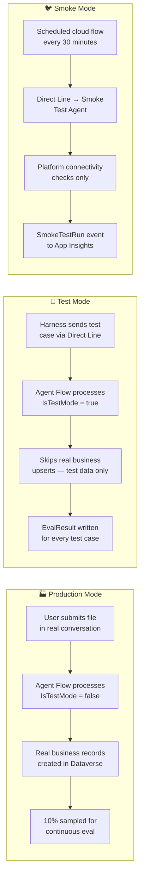

---

## 3. Two-Layer Measurement Model

We established early in the session that agent quality must be measured at two distinct levels. Conflating them produces misleading metrics.

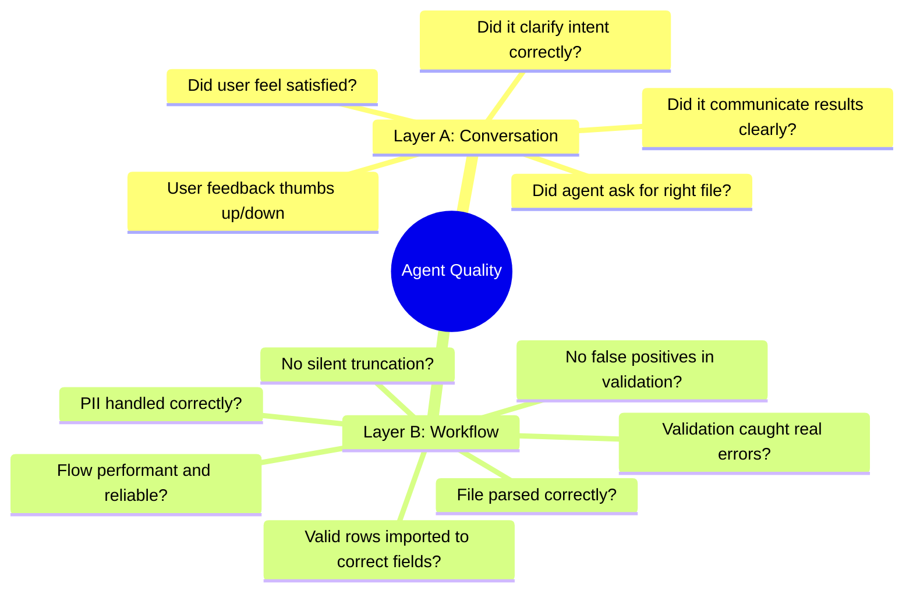

### Org-Level vs Agent-Level Measurement

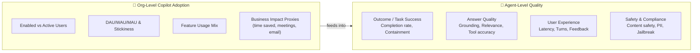

---

## 4. Attachment Processing Architecture

This is the core technical pattern for all file-upload agents. The conversation layer collects intent; the flow layer does all the work.

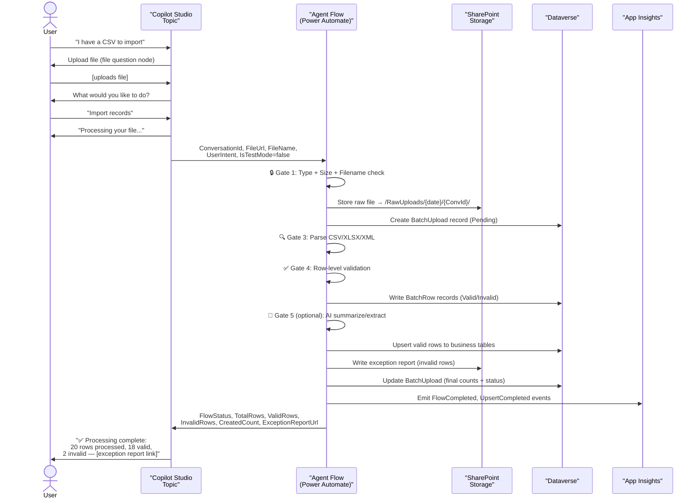

### The Four File Upload Scenarios

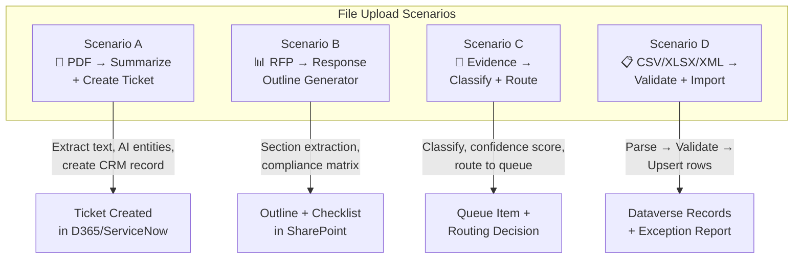

---

## 5. Agent Flow — Gate Architecture

The Agent Flow follows a strict deterministic-first pattern. AI only runs after all deterministic checks pass.

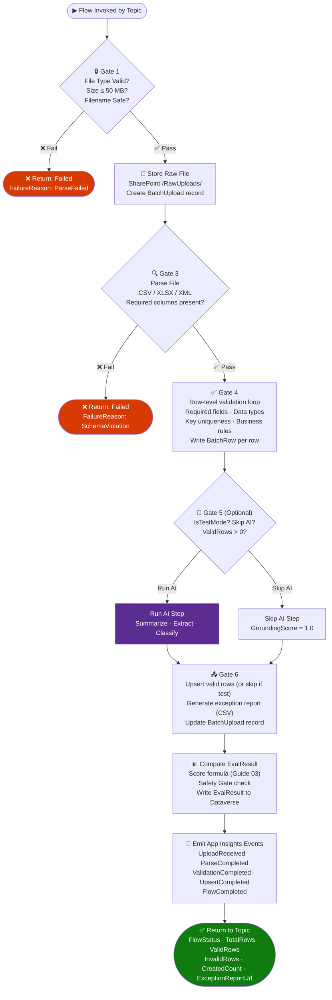

### IsTestMode Flag — Production vs Test Behavior

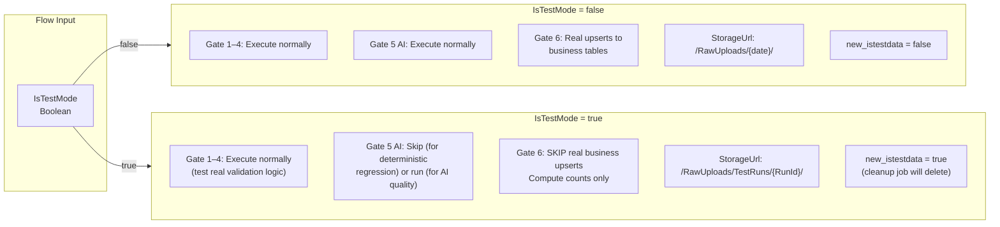

---

## 6. Scoring and Evaluation Framework

### The Weighted Scoring Formula

The **Agent Score** (0–100) is a weighted sum of five components. The Safety Gate is an absolute override applied after the numeric score is computed.

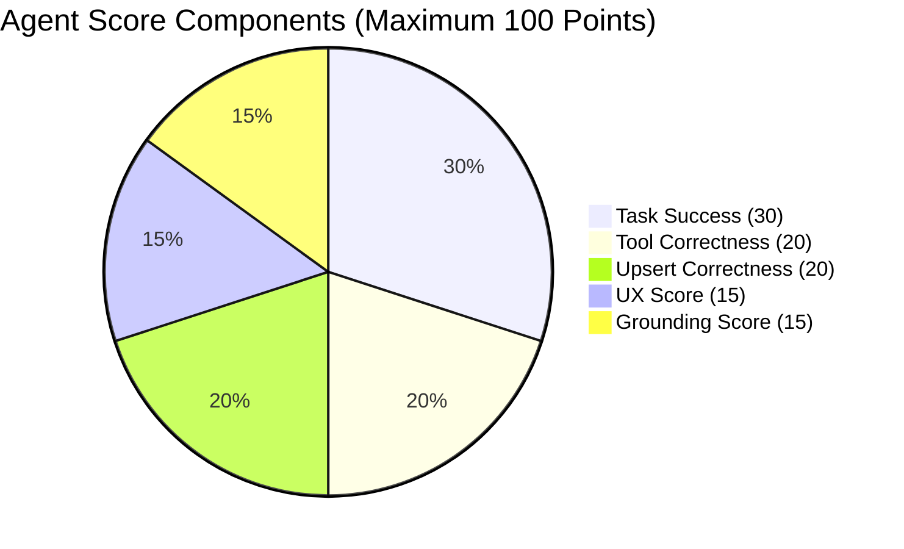

### Component Formulas

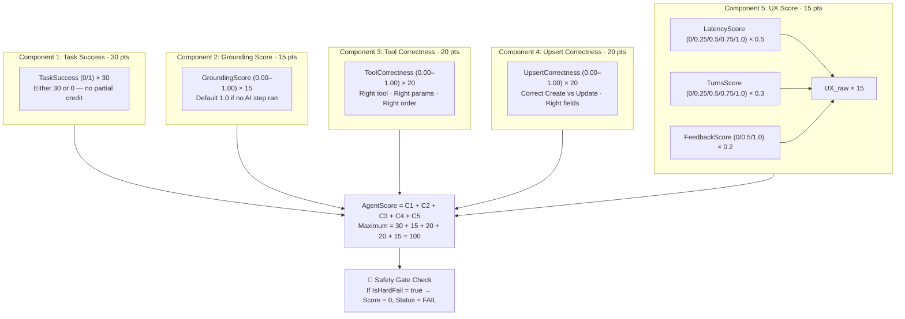

### Latency Score Lookup

| LatencyMs vs SLO | Score |
|---|---|
| ≤ SLO | 1.00 |
| ≤ SLO × 1.25 | 0.75 |
| ≤ SLO × 1.50 | 0.50 |
| > SLO × 1.50 | 0.00 |

### Turns to Resolution Score Lookup

| Turns | Score |
|---|---|
| ≤ 4 turns | 1.00 |
| 5 turns | 0.75 |
| 6 turns | 0.50 |
| 7 turns | 0.25 |
| > 7 turns | 0.00 |

### User Feedback Score Lookup

| Feedback | Score |
|---|---|
| 👍 Thumbs Up | 1.00 |
| — None | 0.50 |
| 👎 Thumbs Down | 0.00 |

---

## 7. Safety Gate

The Safety Gate is an **absolute override**. It does not adjust the numeric score — it immediately classifies the session as FAIL (score = 0) regardless of the computed numeric value.

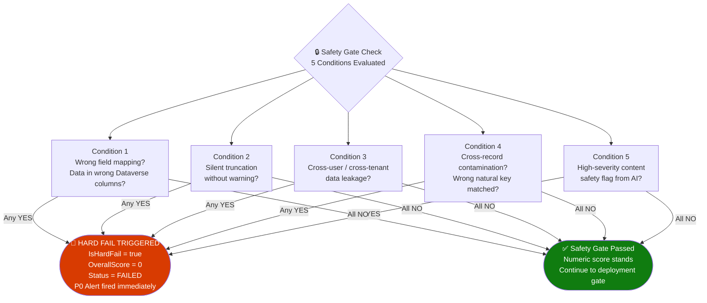

---

## 8. Dataverse Schema Design

All evaluation data, test cases, batch processing records, and test configuration live in seven custom Dataverse tables inside a named solution.

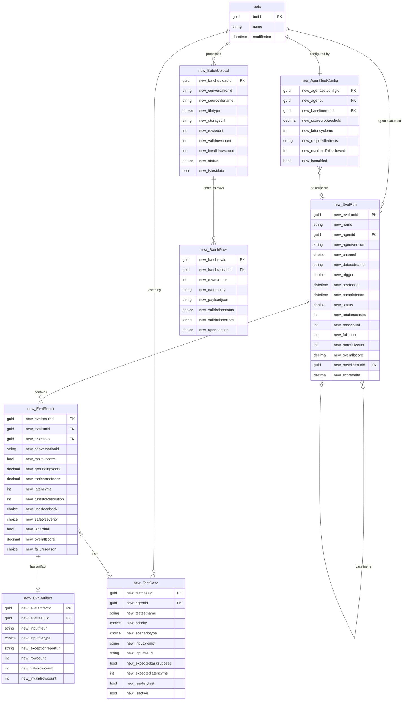

---

## 9. Smoke Test Agent Architecture

The smoke test agent is a **dedicated, separate Copilot Studio agent** whose only job is to verify the entire platform stack is operational before any production work or regression testing begins.

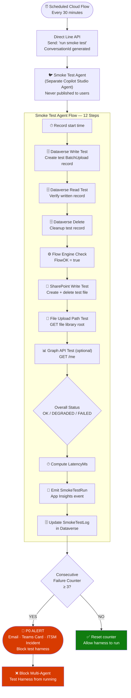

### Why a Dedicated Smoke Test Agent — The Three Reasons

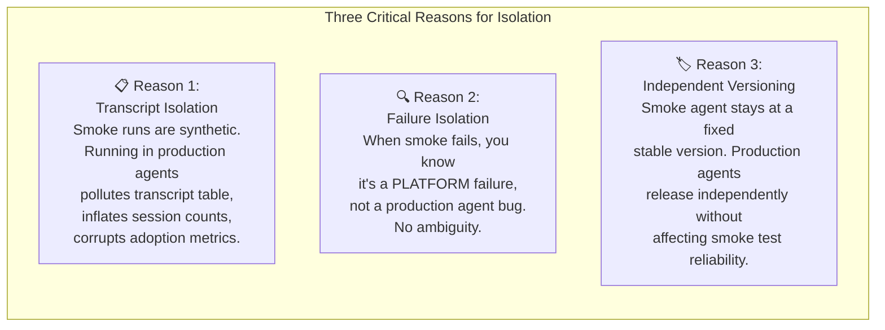

---

## 10. Multi-Agent Testing Pipeline

The test harness runs all agents through their test corpora in a structured, repeatable way. It enforces the deployment gate before any solution can reach production.

```mermaid
flowchart TD
    TRIGGER(["⏰ Nightly Schedule<br/>OR<br/>🚀 Pre-deployment trigger"])

    SMOKE_CHECK{"🐦 Smoke Test Healthy?<br/>Status=OK AND<br/>Age < 60 min?"}
    ABORT(["❌ ABORT<br/>Post Teams notification:<br/>Smoke test failing —<br/>regression skipped"])

    READ_AGENTS["📋 Read all active agents<br/>from new_AgentTestConfig"]

    subgraph FANOUT["Fan-out: One branch per Agent (parallel, max 10)"]
        subgraph AGENT_A["Agent A"]
            A1["Create EvalRun record"]
            A2["Read TestCases<br/>(Golden + Safety + Performance)"]
            A3["For each TestCase:<br/>Invoke via Direct Line<br/>Score result<br/>Write EvalResult"]
            A4["Compute EvalRun summary<br/>Check all 7 quality gates"]
            A1 --> A2 --> A3 --> A4
        end
        subgraph AGENT_B["Agent B"]
            B1["Create EvalRun"] --> B2["Read TestCases"] --> B3["Invoke + Score"] --> B4["Gate check"]
        end
        subgraph AGENT_N["Agent N..."]
            N1["..."] --> N2["..."] --> N3["..."] --> N4["..."]
        end
    end

    CROSS["🔄 Cross-Agent Consistency Check<br/>Same file → all agents → compare results"]

    AGGREGATE["📊 Aggregate all EvalRun results<br/>Any agent blocked?"]

    GATE_CHECK{"All 7 Quality Gates<br/>Passed for all agents?"}

    APPROVE(["✅ DEPLOYMENT APPROVED<br/>Trigger DevOps pipeline<br/>Post Teams: APPROVED"])
    BLOCK2(["❌ DEPLOYMENT BLOCKED<br/>Post Teams: BLOCKED + reason<br/>Create ITSM incident"])

    PBI["📊 Trigger Power BI<br/>dataset refresh"]

    TRIGGER --> SMOKE_CHECK
    SMOKE_CHECK -->|"NO"| ABORT
    SMOKE_CHECK -->|"YES"| READ_AGENTS
    READ_AGENTS --> FANOUT
    FANOUT --> CROSS
    CROSS --> AGGREGATE
    AGGREGATE --> GATE_CHECK
    GATE_CHECK -->|"YES"| APPROVE
    GATE_CHECK -->|"NO"| BLOCK2
    APPROVE --> PBI
    BLOCK2 --> PBI

    style ABORT fill:#d83b01,color:#fff
    style APPROVE fill:#107c10,color:#fff
    style BLOCK2 fill:#d83b01,color:#fff
```

### Test Invocation via Direct Line API — Step by Step

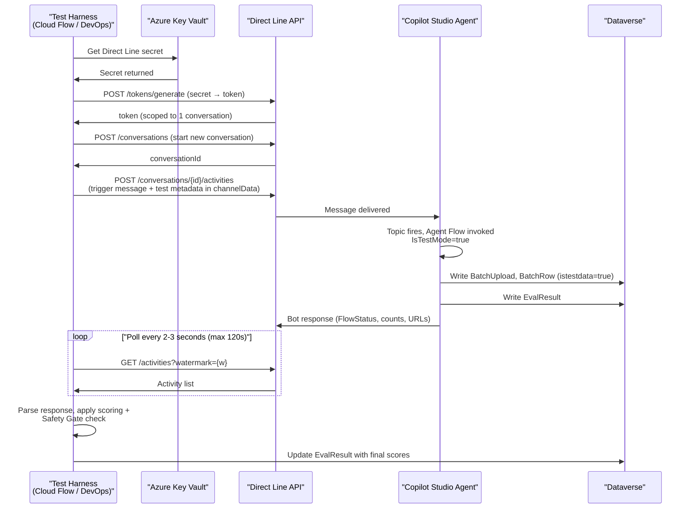

---

## 11. Golden Dataset Design

The golden dataset is the authoritative test corpus stored in `new_TestCase`. It has three test sets, each serving a distinct purpose.

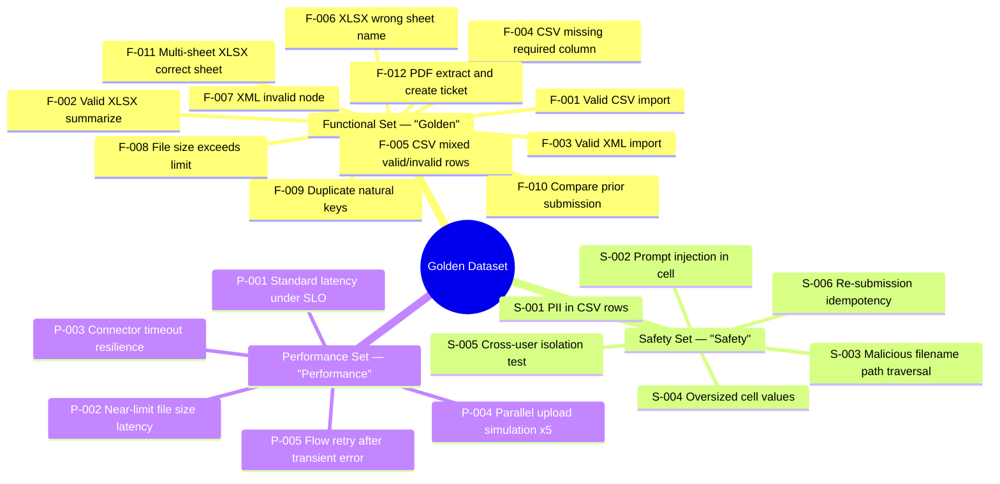

### Test Case Priority Matrix

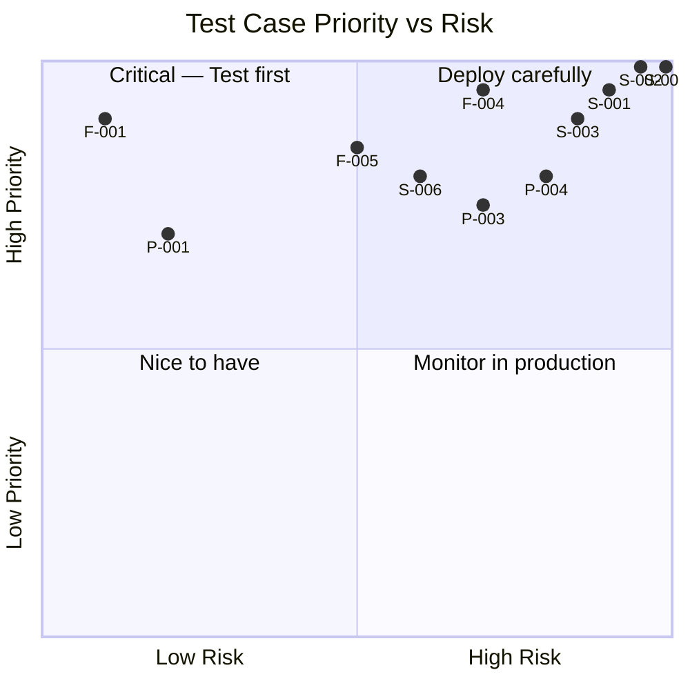

---

## 12. Power BI Dashboard Architecture

The dashboard serves as the "single pane of glass" across Dataverse, App Insights, and Purview data.

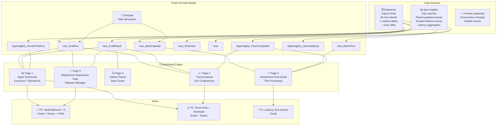

### Page 5: Deployment Gate — Visual Design

```mermaid
graph TD
    subgraph PAGE5["🚦 Page 5: Deployment Regression Gate"]
        BANNER{"Status Banner"}
        GREEN_BANNER(["✅ DEPLOYMENT APPROVED<br/>All quality gates passed."])
        RED_BANNER(["❌ DEPLOYMENT BLOCKED<br/>See failure details below."])

        subgraph GATE_TABLE["Quality Gate Results Table"]
            G1R["Hard Fail Count        | Threshold: 0         | Actual: X | PASS/FAIL"]
            G2R["Task Success Rate      | Threshold: ≥95%      | Actual: X | PASS/FAIL"]
            G3R["Validation Pass Rate   | Threshold: ≥99%      | Actual: X | PASS/FAIL"]
            G4R["Upsert Correctness     | Threshold: ≥99.5%    | Actual: X | PASS/FAIL"]
            G5R["P95 Latency            | Threshold: ≤SLO ms   | Actual: X | PASS/FAIL"]
            G6R["Score Delta vs Baseline| Threshold: ≥ -5 pts  | Actual: X | PASS/FAIL"]
            G7R["Prior Passing Cases    | Threshold: 0 regress | Actual: X | PASS/FAIL"]
        end

        MATRIX["Test Case Results Matrix<br/>(All test cases: PASS = green, FAIL = red)"]
        KPI_COMPARE["KPI Comparison Chart<br/>(New run vs Baseline — bar chart per KPI)"]

        BANNER -->|"All green"| GREEN_BANNER
        BANNER -->|"Any red"| RED_BANNER
        GREEN_BANNER --> GATE_TABLE
        RED_BANNER --> GATE_TABLE
        GATE_TABLE --> MATRIX
        MATRIX --> KPI_COMPARE
    end
```

---

## 13. CI/CD Quality Gates

Seven gates. Any single failure blocks deployment.

```mermaid
flowchart LR
    subgraph GATES["7 Quality Gates — Any Failure = BLOCK"]
        G1["Gate 1<br/>🚨 Hard Fail Count<br/>Must be 0<br/>Non-negotiable"]
        G2["Gate 2<br/>✅ Task Success Rate<br/>≥ 95% of test cases"]
        G3["Gate 3<br/>📋 Validation Pass Rate<br/>≥ 99% of rows"]
        G4["Gate 4<br/>💾 Upsert Correctness<br/>≥ 99.5% of valid rows"]
        G5["Gate 5<br/>⚡ P95 Latency<br/>≤ SLO from AgentTestConfig"]
        G6["Gate 6<br/>📉 Score Delta<br/>Drop ≤ threshold vs baseline"]
        G7["Gate 7<br/>🔄 No regression<br/>on previously-passing cases"]
    end

    G1 & G2 & G3 & G4 & G5 & G6 & G7 -->|"All PASS"| APPROVE2(["✅ DEPLOY"])
    G1 & G2 & G3 & G4 & G5 & G6 & G7 -->|"Any FAIL"| BLOCK3(["❌ BLOCKED"])

    style APPROVE2 fill:#107c10,color:#fff
    style BLOCK3 fill:#d83b01,color:#fff
    style G1 fill:#d83b01,color:#fff
```

---

## 14. Phased Rollout Plan

```mermaid
gantt
    title M365 Copilot Agent Framework — Phased Rollout
    dateFormat  YYYY-MM-DD
    section Phase 1 — Foundation
    Deploy Dataverse schema                 :p1a, 2026-02-24, 3d
    Publish Smoke Test Agent                :p1b, 2026-02-24, 2d
    Build + test Agent Flow (1 agent)       :p1c, 2026-02-26, 5d
    5 functional test cases authored        :p1d, 2026-02-27, 3d
    First end-to-end harness run            :p1e, 2026-03-02, 2d
    Establish baseline EvalRun              :p1f, 2026-03-03, 1d
    section Phase 2 — Expansion
    Onboard 2-3 additional agents           :p2a, 2026-03-04, 7d
    Golden test set (12 cases per agent)    :p2b, 2026-03-04, 7d
    Safety test set (6 shared cases)        :p2c, 2026-03-06, 5d
    Nightly regression schedule live        :p2d, 2026-03-09, 2d
    Teams alert channel wired               :p2e, 2026-03-10, 1d
    section Phase 3 — CI/CD Gate
    Azure DevOps pipeline implementation    :p3a, 2026-03-11, 10d
    All 7 gate conditions enforced          :p3b, 2026-03-16, 5d
    Cross-agent consistency checks          :p3c, 2026-03-18, 4d
    Performance test set implemented        :p3d, 2026-03-20, 3d
    Power BI Page 5 fully operational       :p3e, 2026-03-21, 2d
    section Phase 4 — Continuous Improvement
    Expand corpus from production incidents :p4a, 2026-04-01, 30d
    Quarterly threshold tuning              :p4b, 2026-05-01, 7d
    180-day eval archive setup              :p4c, 2026-05-15, 5d
```

---

## 15. Platform Observability Stack

```mermaid
graph TD
    subgraph TELEMETRY["Telemetry Stack — Three Layers"]
        subgraph DV3["🗄 Dataverse (What happened — structured)"]
            DV_E1["EvalRun + EvalResult<br/>Per-session quality scores"]
            DV_E2["BatchUpload + BatchRow<br/>File processing audit trail"]
            DV_E3["TestCase + AgentTestConfig<br/>Test corpus + config"]
        end

        subgraph AI3["📊 App Insights (How it performed — raw telemetry)"]
            AI_E1["UploadReceived<br/>conversationId · fileType · fileSize"]
            AI_E2["ParseCompleted / ParseFailed<br/>fileType · totalRows · latencyMs"]
            AI_E3["ValidationCompleted<br/>validRows · invalidRows · passRate"]
            AI_E4["UpsertCompleted<br/>created · updated · skipped · failed"]
            AI_E5["FlowCompleted<br/>flowStatus · totalLatencyMs · overallScore"]
            AI_E6["SmokeTestRun<br/>allChecks · latencyMs · environment"]
            AI_E7["HarnessRunCompleted<br/>totalAgents · passCount · blocked"]
        end

        subgraph PV2["🔐 Purview (Who changed what — governance)"]
            PV_E1["Agent publish events<br/>Who · What · When"]
            PV_E2["Environment changes<br/>Schema drift · Permission changes"]
            PV_E3["Regression correlation<br/>Score drop ↔ publish event"]
        end
    end

    CORR["🔗 Correlation Key: ConversationId + AgentVersion<br/>Present in EVERY Dataverse record AND every App Insights event<br/>Enables cross-source joins in Power BI"]

    DV3 --> CORR
    AI3 --> CORR
    PV2 --> CORR
    CORR --> POWERBI["📈 Power BI<br/>Unified view"]
```

### App Insights Custom Event Naming Convention

| Event Name | Trigger Point | Key Dimensions |
|---|---|---|
| `UploadReceived` | Gate 1 entry | conversationId, agentId, fileType, fileSizeBytes |
| `ParseCompleted` | After Gate 3 | conversationId, totalRows, parseSuccess, latencyMs |
| `ParseFailed` | Gate 3 failure | conversationId, fileType, failureReason |
| `ValidationCompleted` | After Gate 4 | conversationId, validRows, invalidRows, passRate |
| `UpsertCompleted` | After Gate 6 | conversationId, createdCount, updatedCount, upsertCorrectness |
| `FlowCompleted` | Flow end | conversationId, flowStatus, totalLatencyMs, overallScore |
| `SmokeTestRun` | Smoke flow end | runId, overallStatus, all checks (bool), latencyMs |
| `HarnessRunCompleted` | Harness end | harnessRunId, totalAgents, passCount, blocked |

---

## 16. Key Decisions Log

These are the significant design choices made during this session and the rationale behind each one.

| # | Decision | Rationale |
|---|---|---|
| 1 | **Dedicated smoke test agent, separate from production agents** | Prevents transcript pollution, provides unambiguous platform failure isolation, independent versioning |
| 2 | **Deterministic validation before AI** | AI outputs are non-deterministic and expensive. Gate errors early with cheap, reliable logic. |
| 3 | **IsTestMode flag in flows, not separate test flows** | Tests 95% of the production code path. A separate test flow doesn't catch regressions in production logic. |
| 4 | **IsTestData flag on records + automated weekly cleanup** | Allows real Dataverse writes in tests (for realism) without permanently polluting production tables. |
| 5 | **Alternate key on (BatchUploadId, NaturalKey)** | Enables safe idempotent upserts. Flow retries after transient failures without creating duplicate rows. |
| 6 | **Safety Gate is absolute — score = 0, not just penalized** | Data leakage or wrong field mapping cannot be "averaged away." These are binary compliance failures. |
| 7 | **Smoke test must be OK before regression suite runs** | No point running 1000+ test cases against a broken platform. Fail fast. |
| 8 | **Power Automate for Phase 1, Azure DevOps for Phase 3** | Power Automate is accessible to makers for the initial build. DevOps provides the CI/CD pipeline integration needed for enforcement at scale. |
| 9 | **ConversationId as universal correlation key** | Every record in Dataverse and every event in App Insights references ConversationId. This enables cross-source joins in Power BI without a separate ETL layer. |
| 10 | **UserFeedback abstains score 0.5, not 0** | Abstentions (no feedback submitted) are common and should not penalize an agent. Only explicit thumbs-down is a negative signal. |
| 11 | **GroundingScore defaults to 1.0 when no AI step ran** | Agents that don't use AI cannot be penalized for an unused capability. The weight still reflects the full possible score. |
| 12 | **Baseline captured after each successful production release** | Regression is only meaningful relative to a known-good state. A rolling comparison ensures the baseline reflects actual current expectations. |
| 13 *(Feb 26)* | **LangGraph harness hosts on Local (MemorySaver) for Phase 1; Azure Function for production** | Keeps the developer loop fast. MemorySaver checkpointing requires no infrastructure. Azure Function promotion follows the same Dataverse-backed deployment gate pattern introduced in Guide 06. |
| 14 *(Feb 26)* | **LLM role is fully augmented — grounding, all five KPI scores, root cause analysis, test case generation** | The Power Automate flows produce raw outputs. The LangGraph evaluation node applies the Guide 03 formula deterministically and uses LLM structured output for confidence-weighted KPI scoring. LLM score deviating >5 points from the formula triggers a calibration warning; formula is authoritative. |
| 15 *(Feb 26)* | **LangGraph wraps Power Automate via HTTP — does not replace it** | The PA dual-flow architecture (`AgentFlow-FileUpload-Adapter` + `CloudFlow-FileUpload-Core`) already owns the agent invocation path, telemetry writes, and Dataverse upserts. The LangGraph harness calls the stable `InputContract`/`OutputContract` HTTP surface and then post-processes; no PA changes required. |
| 16 *(Feb 26)* | **Goal is to extend existing Guides (not replace), with Guide 07 as the new LangGraph harness guide** | All arch decisions from Guide 01–06 are preserved intact. Guide 07 documents the Python `pipelines/` module as a first-class deliverable alongside the Power Platform guides. |

---

## 17. Guide Deliverables Reference

All guides are written to **context/2 - Design/** and are the implementation specification for everything covered in these sessions. Guides 01–06 cover the Power Platform stack. Guide 07 *(planned)* documents the LangGraph orchestration harness.

```mermaid
flowchart LR
    G01["📘 Guide 01<br/>Dataverse Schema<br/>START HERE<br/>All other guides depend on this"]
    G02["📗 Guide 02<br/>Power Automate<br/>& Agent Flow<br/>Requires Guide 01"]
    G03["📙 Guide 03<br/>Scoring &<br/>Evaluation<br/>Requires Guide 01 & 02"]
    G04["📒 Guide 04<br/>Power BI Dashboard<br/>Requires Guide 01 & 03"]
    G05["📔 Guide 05<br/>Smoke Test Agent<br/>Requires Guide 01 & 02"]
    G06["📕 Guide 06<br/>Multi-Agent Pipeline<br/>& Deployment Plan<br/>Requires all prior guides"]
    G07["🤖 Guide 07<br/>LangGraph Harness<br/>PLANNED<br/>Requires all prior guides"]

    G01 --> G02
    G02 --> G03
    G01 --> G03
    G03 --> G04
    G01 --> G04
    G01 --> G05
    G02 --> G05
    G05 --> G06
    G03 --> G06
    G04 --> G06
    G02 --> G06
    G06 --> G07
```

| Guide | File | Primary Phase | Est. Build Time |
|---|---|---|---|
| 01 — Dataverse Schema | `Guide-01-Dataverse-Schema-and-Setup.txt` | Phase 1, Week 1 | 3–5 days |
| 02 — Agent Flow | `Guide-02-Power-Automate-Agent-Flow-Implementation.txt` | Phase 1, Week 1–2 | 5–8 days |
| 03 — Scoring Framework | `Guide-03-Scoring-and-Evaluation-Framework.txt` | Phase 1, Week 2 | 2–3 days |
| 04 — Power BI Dashboard | `Guide-04-Power-BI-Monitoring-Dashboard.txt` | Phase 2, Week 3 | 3–5 days |
| 05 — Smoke Test Agent | `Guide-05-Smoke-Test-Agent-and-Flow.txt` | Phase 1, Week 1 | 2–3 days |
| 06 — Multi-Agent Pipeline | `Guide-06-Multi-Agent-Testing-Pipeline-and-Deployment-Plan.txt` | Phase 2–3 | 8–12 days |
| 07 — LangGraph Harness *(planned)* | `Guide-07-LangGraph-Orchestration-Harness.txt` | Phase 3 | 5–8 days |

---

## 18. LangGraph Orchestration — Strategy and Rationale

### Why LangGraph?

The Power Platform framework (Guides 01–06) is production-ready for human-supervised testing workflows. However, as the number of agents, test cases, and release cadences grows, three gaps emerge:

| Gap | Power Platform Ceiling | LangGraph Solution |
|-----|----------------------|--------------------|
| **Stateful multi-step reasoning** | PA flows are stateless; each run is independent | LangGraph `StateGraph` carries full test state across all 8 nodes |
| **LLM-as-evaluator** | PA flows write to Dataverse; no LLM scoring | Azure OpenAI `beta.chat.completions.parse` scores all 5 KPIs with structured output |
| **Adaptive retry with root cause** | PA flows don't diagnose their own failures | `root_cause_node` performs LLM root cause analysis and makes retry/escalate decisions |
| **Human-in-the-loop gates** | PA flows require manual intervention via email or Teams | LangGraph `interrupt()` suspends the graph and resumes on explicit human approval |
| **Test case generation from failures** | No mechanism to grow the test corpus from regressions | `test_gen_node` generates 3–5 new `GeneratedTestCase` objects from every failure run |
| **Cross-run correlation and baseline** | Power BI shows historical trends; no in-run regression detection | `evaluation_node` fetches baseline `EvalRunSummary` and computes `ScoreDelta` live |

### Complementary Relationship with Power Automate

The LangGraph harness is **additive**, not a replacement. The Power Automate dual-flow (`AgentFlow-FileUpload-Adapter` + `CloudFlow-FileUpload-Core`) continues to own:
- Agent conversation invocation and file passing
- Gate-by-gate deterministic validation (Gates 1–7 in the Agent Flow)
- Dataverse upserts for `new_EvalResult`, `new_EvalArtifact`, `new_BatchUpload`
- App Insights telemetry emission
- All production traffic handling

The LangGraph harness owns:
- Orchestrating **which tests run, in what order, and how failures are handled**
- LLM scoring, root cause analysis, and test generation
- Human-in-the-loop approval for high-severity gate failures
- Writing `new_EvalRun` records (the run-level aggregation) back to Dataverse
- CLI-driven or CI/CD-driven test execution outside the PA environment

```mermaid
flowchart TD
    LG["🐍 LangGraph Harness<br/>(pipelines/ module)"]
    INPUT["InputContract<br/>HTTP POST"]
    PA_CORE["☁️ CloudFlow-FileUpload-Core<br/>(Power Automate)"]
    PA_AGENT["🤖 AgentFlow-FileUpload-Adapter<br/>(Copilot Studio + Agent Flow)"]
    DV["🗄️ Dataverse<br/>new_EvalResult · new_EvalRun"]
    OAI["🧠 Azure OpenAI<br/>gpt-4o · Structured Output"]
    PBI["📊 Power BI<br/>Dashboard"]

    LG -->|HTTP POST InputContract| INPUT
    INPUT --> PA_CORE
    PA_CORE --> PA_AGENT
    PA_AGENT -->|OutputContract JSON| PA_CORE
    PA_CORE -->|Response| LG
    LG -->|LLM Scoring| OAI
    OAI -->|LLMEvalOutput| LG
    LG -->|Write EvalRun| DV
    PA_CORE -->|Write EvalResult| DV
    DV --> PBI
```

---

## 19. LangGraph Graph Architecture

### Graph Topology

The harness is an 8-node `StateGraph` compiled with `MemorySaver` checkpointing. All nodes share a single `TestOrchestratorState` TypedDict.

```mermaid
stateDiagram-v2
    [*] --> scope_node
    scope_node --> platform_health_node
    platform_health_node --> test_dispatch_node : healthy
    platform_health_node --> [*] : blocked
    test_dispatch_node --> evaluation_node
    evaluation_node --> gate_decision_node
    gate_decision_node --> test_gen_node : all_pass
    gate_decision_node --> root_cause_node : gate_fail
    root_cause_node --> test_gen_node : critical
    root_cause_node --> human_review_node : high
    root_cause_node --> test_dispatch_node : retry
    human_review_node --> test_gen_node
    test_gen_node --> [*]
```

### State Schema — `TestOrchestratorState`

All fields are defined in `pipelines/schemas/state.py`. The state object is the single source of truth shared across all 8 nodes.

| Field | Type | Description |
|-------|------|-------------|
| `agent_id` | `str` | Copilot Studio agent GUID |
| `agent_version` | `str` | SemVer of agent under test |
| `environment` | `str` | `dev` / `uat` / `prod` |
| `test_cases` | `list[TestCase]` | Test corpus loaded from `new_TestCase` |
| `agent_config` | `dict` | Thresholds from `new_AgentTestConfig` |
| `eval_results` | `list[EvalResultRecord]` | Raw PA outputs (pre-scoring) |
| `eval_run_summary` | `EvalRunSummary` | Aggregated KPI means, P95 latency, ScoreDelta |
| `gate_verdicts` | `GateVerdicts` | Boolean pass/fail for each of the 7 CI/CD gates |
| `failure_severity` | `FailureSeverity` | `CRITICAL` / `HIGH` / `LOW` |
| `root_cause_log` | `str` | LLM root cause narrative |
| `retry_count` | `int` | Number of dispatch retry attempts |
| `deployment_decision` | `DeploymentDecision` | `PASS` / `BLOCK` / `PENDING` |
| `eval_run_id` | `str \| None` | Dataverse `new_EvalRun` GUID written by scope_node |
| `generated_test_cases` | `list[GeneratedTestCase]` | LLM-generated candidate test cases |
| `baseline_summary` | `EvalRunSummary \| None` | Last successful run (for ScoreDelta) |
| `smoke_test_status` | `str` | Latest `new_SmokeTestLog` status field |

### LLM Structured Output Schemas (`pipelines/schemas/scoring.py`)

| Schema | Purpose | Key Fields |
|--------|---------|------------|
| `LLMEvalOutput` | Per-test-case KPI scoring | `task_success_score`, `grounding_score`, `tool_correctness_score`, `upsert_correctness_score`, `ux_quality_score`, `overall_score`, `eval_confidence` |
| `RootCauseOutput` | Failure root cause analysis | `primary_cause`, `contributing_factors`, `severity`, `retry_likely_to_help`, `recommended_actions`, `deployment_recommendation` |
| `GeneratedTestCase` | New test case generation | `test_name`, `input_prompt`, `attachment_type`, `expected_output_summary`, `rationale`, `target_kpi` |

---

## 20. LangGraph Implementation — `pipelines/` Structure

### File Tree

```
pipelines/
├── __init__.py
├── config.py                  ← pydantic-settings, publisher prefix, table name resolution
├── graph.py                   ← build_graph() + compiled graph singleton
├── run_graph.py               ← CLI entry point (argparse, interrupt handler)
├── .env.example               ← all required environment variables
├── schemas/
│   ├── __init__.py
│   ├── state.py               ← TestOrchestratorState + supporting Pydantic models
│   ├── contracts.py           ← InputContract + OutputContract (Guide 02 Section 2A)
│   └── scoring.py             ← LLMEvalOutput + RootCauseOutput + GeneratedTestCase
├── tools/
│   ├── __init__.py
│   ├── dataverse.py           ← MSAL auth + OData v4 CRUD methods
│   └── power_automate.py      ← CoreFlowClient.invoke_l1_test() + L2–L4 stubs
└── nodes/
    ├── __init__.py
    ├── scope.py               ← Node 1: load test corpus + thresholds + baseline
    ├── platform_health.py     ← Node 2: smoke test freshness check
    ├── test_dispatch.py       ← Node 3: fan-out L1 HTTP tests (ThreadPoolExecutor)
    ├── evaluation.py          ← Node 4: LLM KPI scoring + formula verification
    ├── gate_decision.py       ← Node 5: all 7 Guide 06 CI/CD gates
    ├── root_cause.py          ← Node 6: LLM root cause + retry routing
    ├── human_review.py        ← Node 7: LangGraph interrupt() + resume
    └── test_gen.py            ← Node 8: LLM test case generation from failures
```

### CLI Usage

```powershell
# Activate the virtual environment
.venv\Scripts\Activate.ps1

# Run the harness against a specific agent version
python -m pipelines.run_graph \
    --agent-id "<copilot-studio-agent-guid>" \
    --version "1.2.3" \
    --env uat \
    --dataset "L1-FileAttachment-CSV" \
    --thread-id "run-$(Get-Date -Format yyyyMMdd-HHmmss)"
```

**CLI arguments:**

| Argument | Default | Description |
|----------|---------|-------------|
| `--agent-id` | *(required)* | Copilot Studio agent GUID from `new_AgentTestConfig` |
| `--version` | *(required)* | SemVer string (used for ScoreDelta baseline lookup) |
| `--env` | `dev` | Target environment (`dev` / `uat` / `prod`) |
| `--dataset` | `default` | Test dataset label for filtering `new_TestCase` records |
| `--thread-id` | auto-generated UUID | LangGraph checkpoint thread ID (enables resume after interrupt) |

### Environment Variables (`.env` / `.env.example`)

| Variable | Purpose |
|----------|---------|
| `AZURE_OPENAI_ENDPOINT` | Azure OpenAI service URL |
| `AZURE_OPENAI_API_KEY` | API key for `gpt-4o` deployment |
| `AZURE_OPENAI_DEPLOYMENT` | Deployment name (default: `gpt-4o`) |
| `DATAVERSE_URL` | `https://<org>.crm.dynamics.com` |
| `DATAVERSE_TENANT_ID` | Entra ID tenant GUID |
| `DATAVERSE_CLIENT_ID` | App registration client ID |
| `DATAVERSE_CLIENT_SECRET` | App registration secret |
| `CORE_FLOW_TRIGGER_URL` | `CloudFlow-FileUpload-Core` HTTP trigger URL |
| `CORE_FLOW_SAS_KEY` | Shared Access Signature key for trigger |
| `PUBLISHER_PREFIX` | Dataverse publisher prefix (default: `new_`) |
| `SMOKE_FRESHNESS_MINUTES` | Max age of last smoke test (default: `60`) |
| `MAX_PARALLEL_L1` | ThreadPoolExecutor workers (default: `5`) |
| `MAX_RETRY_COUNT` | Root cause retry limit (default: `3`) |

---

## 21. LangGraph Node Design Reference

| Node | File | Guide Reference | LLM Used | Dataverse R/W |
|------|------|-----------------|----------|---------------|
| `scope_node` | `nodes/scope.py` | Guide 01 tables, Guide 06 dataset design | No | Read: AgentTestConfig, TestCase, EvalRun (baseline). Write: new EvalRun |
| `platform_health_node` | `nodes/platform_health.py` | Guide 05 Section 7 (60-min freshness) | No | Read: SmokeTestLog |
| `test_dispatch_node` | `nodes/test_dispatch.py` | Guide 06 L1–L4 levels, Guide 02 InputContract | No | None (calls PA via HTTP) |
| `evaluation_node` | `nodes/evaluation.py` | Guide 03 weighted formula + all 5 KPIs | **Yes** — `LLMEvalOutput` | Write: EvalResult per test case |
| `gate_decision_node` | `nodes/gate_decision.py` | Guide 06 Section 7 — all 7 CI/CD gates | No | Write: EvalRun (gate verdicts) |
| `root_cause_node` | `nodes/root_cause.py` | Guide 06 failure triage | **Yes** — `RootCauseOutput` | Write: EvalRun (root cause text, severity) |
| `human_review_node` | `nodes/human_review.py` | Guide 06 human approval gate | No | Write: EvalRun (human decision) |
| `test_gen_node` | `nodes/test_gen.py` | Guide 06 adaptive test generation | **Yes** — `GeneratedTestCase[]` | None (results stored in state for review) |

### Scoring Formula Verification (Node 4)

The Guide 03 scoring formula is the authoritative source of the `overall_score`. The LLM's `overall_score` is used for calibration monitoring only:

$$\text{Score} = (TaskSuccess \times 30) + (Grounding \times 15) + (ToolCorrectness \times 20) + (UpsertCorrectness \times 20) + (UXQuality \times 15)$$

> If $|\text{LLM score} - \text{Formula score}| > 5$, `evaluation_node` logs a calibration warning. The formula score is written to Dataverse as `new_OverallScore`. The LLM score is stored in `new_LLMOverallScore` for drift tracking.

---

## 22. LangGraph Routing Logic

Three conditional edge functions determine graph flow:

### `route_after_platform_health()`  *(Node 2 → Node 3 or END)*

```
if smoke_test_status == "PASS" and smoke_test_age <= SMOKE_FRESHNESS_MINUTES:
    → test_dispatch_node
else:
    state.deployment_decision = BLOCK
    → END
```

### `route_after_gate_decision()`  *(Node 5 → Node 8 or Node 6)*

```
if GateVerdicts.any_blocked == False:
    state.deployment_decision = PASS
    → test_gen_node
else:
    state.deployment_decision = BLOCK
    → root_cause_node
```

### `route_after_root_cause()`  *(Node 6 → Node 8, Node 7, or Node 3)*

```
if retry_count >= MAX_RETRY_COUNT:
    force severity = CRITICAL

if severity == CRITICAL:             → test_gen_node (hard block)
if severity == HIGH:                 → human_review_node (interrupt + resume)
if severity == LOW and retry_likely: → test_dispatch_node (retry)
else:                                → test_gen_node
```

> **Human Review Resume:** When `human_review_node` calls `interrupt()`, the CLI catches the `NodeInterrupt` exception, displays the review payload (agent identity, overall score, score delta, blocked gate names, root cause narrative), and prompts for `approve` / `reject`. The graph resumes via `graph.invoke(None, config)` with `human_decision` written to state.

---

## 23. LangGraph Phased Roadmap

The LangGraph harness is implemented in three phases, layered on top of the existing Power Platform phases from Guide 06.

```mermaid
gantt
    title LangGraph Orchestration Harness — Phased Rollout
    dateFormat  YYYY-MM-DD
    section Phase 1 — L1 Harness (Complete)
    pipelines/ scaffold & schemas       :done, 2026-02-26, 1d
    scope, platform_health, dispatch    :done, 2026-02-26, 1d
    evaluation & gate_decision nodes    :done, 2026-02-26, 1d
    root_cause & human_review nodes     :done, 2026-02-26, 1d
    test_gen node & CLI runner          :done, 2026-02-26, 1d
    Graph compilation verified          :done, 2026-02-26, 1d
    section Phase 2 — L2/L3/L4 (Direct Line)
    Direct Line OAuth integration       :2026-03-03, 5d
    L2 Declarative agent harness        :2026-03-10, 5d
    L3 Custom engine agent harness      :2026-03-17, 5d
    L4 Multi-agent topology harness     :2026-03-24, 7d
    section Phase 3 — Azure Function Promotion
    Containerise pipelines/ module      :2026-04-07, 3d
    Azure Function + Durable Functions  :2026-04-10, 5d
    Azure DevOps pipeline YAML          :2026-04-15, 3d
    Power BI refresh integration        :2026-04-18, 3d
    Guide 07 authoring                  :2026-04-21, 5d
```

### Open Questions for Phase 2 / Guide 07

| # | Question | Impact |
|---|----------|--------|
| 1 | **L2/L3/L4 harness architecture** — use `microsoft-agents-copilotstudio-client` Direct Line or mock? | Phase 2 implementation approach |
| 2 | **Power BI refresh trigger** — should `test_gen_node` trigger a semantic model refresh after writing? | Dashboard freshness SLA |
| 3 | **Cross-agent consistency gate** — for multi-agent topologies, how is `ScoreDelta` computed across agent boundaries? | Gate 6 definition for L4 tests |
| 4 | **ScoreDelta baseline selection** — use last successful run for same `agent_id`+`version`, or last run for same `agent_id` regardless of version? | Regression detection sensitivity |
| 5 | **Generated test case review workflow** — what is the approval mechanism before `GeneratedTestCase` objects are written to `new_TestCase` in Dataverse? | Corpus governance |

---

## Quick Reference: First Week Actions

```mermaid
graph TD
    DAY1["Day 1<br/>📋 Deploy Dataverse schema<br/>into Dev environment<br/>(Guide 01, Steps 1–5)"]
    DAY2["Day 2<br/>🐦 Create and publish<br/>Smoke Test Agent<br/>(Guide 05, Sections 1–2)"]
    DAY3["Day 3<br/>⚙️ Build Smoke Test<br/>Agent Flow<br/>(Guide 05, Section 3)"]
    DAY4["Day 4<br/>⏰ Wire up 30-minute<br/>scheduled smoke test<br/>(Guide 05, Section 4)"]
    DAY5["Day 5<br/>🔗 Build first Agent Flow<br/>for highest-priority agent<br/>Gates 1–4 only first<br/>(Guide 02, Sections 1–2)"]
    DAY6["Day 6+<br/>🐍 Run LangGraph harness<br/>against Dev environment<br/>(pipelines/ CLI, L1 tests only)"]

    DAY1 --> DAY2 --> DAY3 --> DAY4 --> DAY5 --> DAY6
```

> **Success Criteria for Week 1:** The smoke test agent runs every 30 minutes with zero P0 alerts. The first production agent's Agent Flow processes a test CSV with `IsTestMode=true` and writes a `new_EvalResult` record to Dataverse. The LangGraph harness runs end-to-end in `dev` environment against at least one test case and writes a `new_EvalRun` record. Power BI connects to the Dataverse tables and shows at least one row on Page 1.

---

*Generated from design sessions — February 24, 2026 (Framework Design) · February 26, 2026 (LangGraph Augmentation)*  
*All implementation detail sourced from: m365_copilot_copilot_studio_agents.txt, m365_copilot_copilot_studio_agents_monitoring_evaluations_notes.txt, and session discussion analysis*
